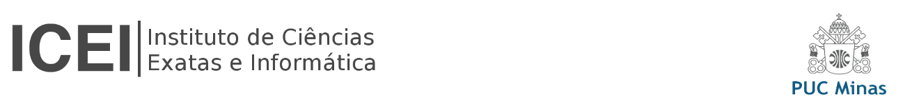

# Nome do projeto

Escreva um ou dois parágrafos resumindo o objetivo do seu projeto.

## Alunos integrantes da equipe

* [Nome completo do aluno 1 (com link para Github)](https://github.com/aluno1)
* [Nome completo do aluno 2 (com link para Github)](https://github.com/aluno2)
* [Nome completo do aluno 3 (com link para Github)](https://github.com/aluno3)
* [Nome completo do aluno 4 (com link para Github)](https://github.com/aluno4)
* [Nome completo do aluno 5 (com link para Github)](https://github.com/aluno5)

## Professor responsável

* [Felipe A. L. Reis](https://github.com/falreis)

## Gerenciamento do Projeto

Adicione aqui informações sobre o projeto que será gerenciado. 

Indique informações importantes sobre o projeto.

Gerenciamento do Projeto:
1. [Iniciação](docs/01-iniciacao/README.md)
2. [Planejamento](docs/02-planejamento/README.md)
3. [Execução](docs/03-execucao/README.md)
4. [Monitoramento](docs/04-monitoramento/README.md)
5. [Encerramento](docs/05-encerramento/README.md)

Link importante: https://www.gestaodeprojeto.info/8documentos

## Apresentação do Trabalho

Adicione aqui o vídeo explicativo do trabalho.
Utilize a estrutura (link) abaixo para apresentação do vídeo.

## Informações Adicionais

Inclua aqui informações extra sobre o projeto.

Caso não existam informações extras, remova a seção.
